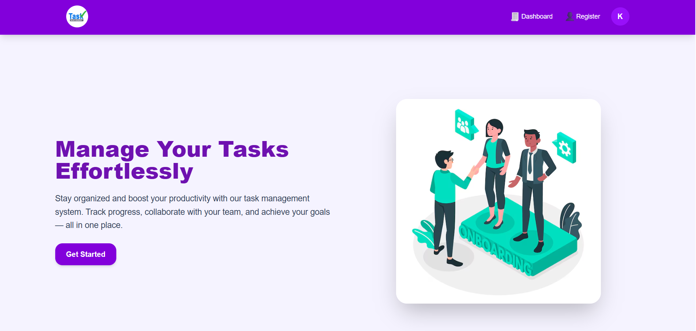
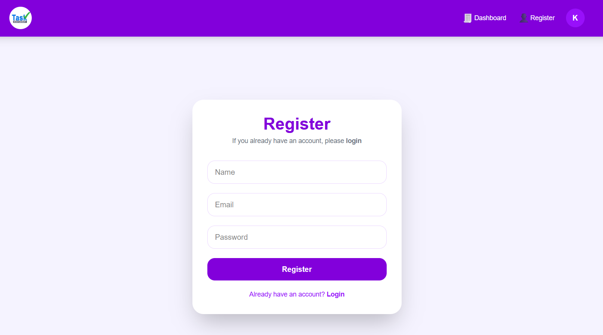
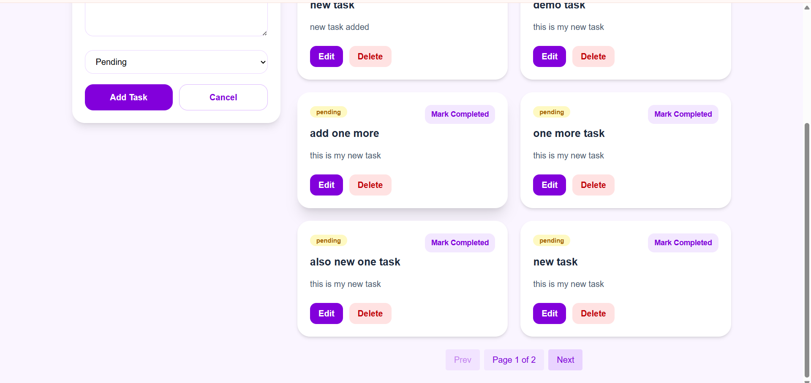
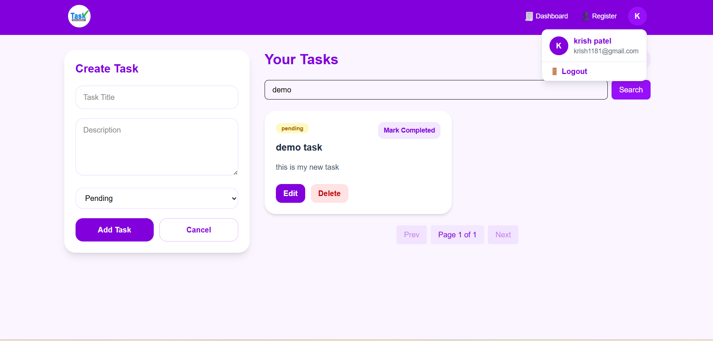

# Task Management Application

A modern, responsive task management application built with **React**, **Vite**, **Tailwind CSS**, and **Axios**. This application allows users to create, search, and manage their tasks with pagination support.

## 🎯 Features

- **User Authentication**: Register and login functionality with secure user sessions
- **Task Management**: Create, read, update, and delete tasks
- **Search Functionality**: Search tasks by title or description
- **Pagination**: Navigate through tasks with page-based pagination
- **Responsive Design**: Fully responsive UI built with Tailwind CSS
- **Context API**: Global state management for user information
- **Modern UI**: Clean and intuitive user interface

## 📋 Tech Stack

- **Frontend Framework**: React 19.2.6
- **Build Tool**: Vite 8.0.12
- **Styling**: Tailwind CSS 4.3.0
- **HTTP Client**: Axios 1.17.0
- **Routing**: React Router DOM 7.16.0
- **Code Quality**: ESLint with React hooks support

## 🚀 Getting Started

### Prerequisites
- Node.js (v14 or higher)
- npm or yarn

### Installation

1. **Clone the repository**
   ```bash
   git clone <repository-url>
   cd task-management
   ```

2. **Install dependencies**
   ```bash
   npm install
   ```

3. **Start the development server**
   ```bash
   npm run dev
   ```

4. **Open in browser**
   - Navigate to `http://localhost:5173` (or the port shown in your terminal)

### Build for Production
```bash
npm run build
```

### Preview Production Build
```bash
npm run preview
```

## 📱 How to Use the Application

### Step 1: Home Page
When you first visit the application, you'll see the Home page with navigation options.



### Step 2: Register a New Account
1. Click on the **"Register"** button in the navbar
2. Fill in the registration form with:
   - Full Name
   - Email Address
   - Password
3. Click **"Register"** to create your account



### Step 3: Login to Your Account
1. Click on the **"Login"** button in the navbar
2. Enter your email and password
3. Click **"Login"** to access your dashboard

**Note**: If you're already registered, use your credentials to login.

### Step 4: Add a New Task
Once logged in, you'll be redirected to your Dashboard:
1. You'll see the **"Add Task"** form at the top
2. Enter:
   - **Task Title**: Brief description of what you need to do
   - **Task Description**: More details about the task
   - **Priority**: Select from Low, Medium, or High
3. Click **"Add Task"** to create your new task



### Step 5: Search for Tasks
1. Use the **Search Bar** in the Dashboard
2. Type keywords from the task title or description
3. Results will filter in real-time as you type
4. Click **"Clear"** to reset the search



### Step 6: Navigate with Pagination
1. Below your task list, you'll see **pagination controls**
2. Use the **Previous** and **Next** buttons to navigate between pages
3. View page numbers to see your current position
4. Each page displays a set number of tasks

**Pagination Features**:
- Navigate forward and backward through tasks
- See current page number
- Quick access to different pages
- Automatic page reset when searching

### Step 7: Delete a Task
1. Locate the task you want to delete in your Dashboard
2. Click the **"Delete"** button on the task card
3. Confirm the deletion when prompted
4. The task will be removed from your list

**Note**: Once deleted, tasks cannot be recovered.

## 🛠️ Available Scripts

- `npm run dev` - Start development server with hot reload
- `npm run build` - Create optimized production build
- `npm run preview` - Preview production build locally
- `npm run lint` - Check code quality with ESLint

## 🎨 Styling

The application uses **Tailwind CSS** for styling. All components are styled with:
- Responsive design principles
- Dark mode support ready
- Consistent color scheme
- Smooth transitions and hover effects

## 📡 API Integration

The application uses **Axios** for HTTP requests. API calls are centralized in `src/services/api.js` for:
- User registration and authentication
- Task CRUD operations
- Pagination requests

## 🔐 User Context

Global user state is managed through **React Context API** (`UserContext.jsx`):
- User authentication status
- User information (name, email)
- Login/logout functionality
- Protected routes

## 📝 Notes

- All forms include validation to ensure data integrity
- Tasks are persisted in the backend database
- User sessions are maintained through authentication tokens
- The application supports multiple users with separate task lists

## 🤝 Contributing

Feel free to fork this project and submit pull requests for any improvements.

## 📄 License

This project is open source and available under the MIT License.
